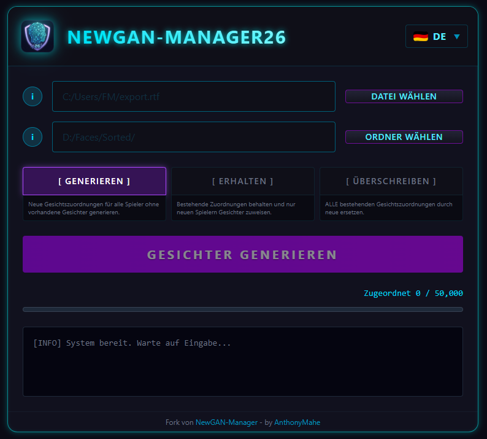

<p align="center">
  
</p>

<h1 align="center">NewGAN Manager 26</h1>

<h4 align="center">📖 In Ihrer Sprache lesen</h4>

<p align="center">
  <a href="README.md"></a>&nbsp;
  <a href="README.fr.md"></a>&nbsp;
  <a href="README.es.md"></a>&nbsp;
  <a href="README.de.md"></a>&nbsp;
  <a href="README.it.md"></a>&nbsp;
  <a href="README.pt.md"></a>&nbsp;
  <a href="README.ua.md"></a>&nbsp;
  <a href="README.kr.md"></a>&nbsp;
  <a href="README.cn.md"></a>
</p>

---

#


**Ein moderner Gesichtsgenerator für Football Manager 26 Newgens.**

Dies ist eine komplette Neuentwicklung des ursprünglichen [NewGAN-Manager](https://github.com/Maradonna90/NewGAN-Manager) von Maradonna90, von Grund auf neu aufgebaut mit **Tauri + Svelte 5** für verbesserte Leistung und eine moderne Benutzeroberfläche.

<p align="center">
  
</p>

---

## 🎮 Funktionen

- **8 Sprachen**: Englisch, Französisch, Deutsch, Spanisch, Italienisch, Koreanisch, Chinesisch, Ukrainisch
- **Moderne Benutzeroberfläche**: Dunkle Oberfläche mit klarem Design
- **Leichtgewichtig**: Mit Tauri (Rust + WebView) statt Electron gebaut
- **Intelligente Validierung**: Der Generierungsbutton bleibt deaktiviert, bis eine gültige RTF-Datei und ein Bildordner ausgewählt sind
- **3 Modi**: Generieren (Generate), Beibehalten (Preserve), Überschreiben (Overwrite)

---

## 📥 Installation

### Windows
1. Laden Sie die neueste `.exe` (portable) oder den `.msi` Installer von [Releases](https://github.com/AnthonyMahe/NewGAN-Manager-26/releases) herunter
2. Führen Sie die Anwendung aus
3. Verschieben Sie die Ordner `views/` und `filters/` in Ihren Football Manager Benutzerordner:
   ```
   Documents\Sports Interactive\Football Manager 2026\
   ```
4. Starten Sie NewGAN Manager 26

### Linux
1. Laden Sie das `.AppImage` oder `.deb` von [Releases](https://github.com/AnthonyMahe/NewGAN-Manager-26/releases) herunter
2. Für AppImage: `chmod +x *.AppImage` und dann ausführen
3. Für .deb: `sudo dpkg -i *.deb`
4. Verschieben Sie die Ordner `views/` und `filters/` in Ihren Football Manager Benutzerordner:
   ```
   ~/.local/share/Sports Interactive/Football Manager 2026/
   ```
5. Starten Sie NewGAN Manager 26

---

## 🚀 Verwendung

### Voraussetzungen
- Verwenden Sie **English (UK)** als FM-Sprache (andere Sprachen können unterschiedliche Ländercodes haben)
- Verwenden Sie das **FM Standard-Skin** (benutzerdefinierte Skins können Flaggen statt Ländercodes verwenden)

### Schritte
1. Gehen Sie in Football Manager zu einer Spielersuche/Kaderansicht
2. Wählen Sie alle Spieler aus (Strg+A)
3. Rechtsklick → **Als Webseite exportieren** → Als `.rtf` speichern
4. Öffnen Sie NewGAN Manager 26
5. Wählen Sie die exportierte `.rtf` Datei
6. Wählen Sie Ihr Gesichter-Verzeichnis (nach Ethnien-Ordnern organisiert)
7. Wählen Sie einen Modus:
   - **Generate**: Weist Spielern ohne vorhandene Gesichter Gesichter zu
   - **Preserve**: Behält vorhandene Zuordnungen bei, weist nur neuen Spielern zu
   - **Overwrite**: Ersetzt alle vorhandenen Gesichtszuordnungen
8. Klicken Sie auf **GENERATE FACES**

---

## 👥 Credits

### Original NewGAN-Manager
- **[Maradonna](https://github.com/Maradonna90)**: Ersteller & Hauptentwickler
- **Samaroy**: Koordination, Bilderzeugung
- **[HRiddick](https://sortitoutsi.net/user/profile/137954)**: Bildbereinigung
- **[Krysler76](https://community.sigames.com/profile/157461-krysler76/)**: FM View Hacking
- **Ayal, Zealand, ZeBurgs**: Bilderzeugung

### NewGAN Manager 26
- **[AnthonyMahe](https://github.com/AnthonyMahe)**: Neuentwicklung mit Tauri + Svelte 5

---

## 📄 Lizenz

Dieses Projekt ist ein Fork des ursprünglichen NewGAN-Manager. Siehe das ursprüngliche Repository für Lizenzinformationen.

---

## 🐛 Fehlerbehebung

Bei Problemen öffnen Sie bitte ein [Issue](https://github.com/AnthonyMahe/NewGAN-Manager-26/issues) mit:
- Ihrem Betriebssystem
- Schritten zur Reproduktion
- Fehlermeldungen oder Screenshots
