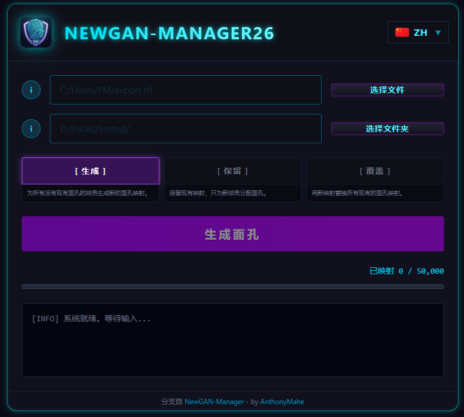

<p align="center">
  
</p>

<h1 align="center">NewGAN Manager 26</h1>

<h4 align="center">📖 Read in your language</h4>

<p align="center">
  <a href="README.cn.md"></a>&nbsp;
  <a href="README.kr.md"></a>&nbsp;
  <a href="README.da.md"></a>&nbsp;
  <a href="README.de.md"></a>&nbsp;
  <a href="README.el.md"></a>&nbsp;
  <a href="README.md"></a>&nbsp;
  <a href="README.es.md"></a>&nbsp;
  <a href="README.fr.md"></a>&nbsp;
  <a href="README.it.md"></a>&nbsp;
  <a href="README.nl.md"></a>&nbsp;
  <a href="README.pl.md"></a>&nbsp;
  <a href="README.pt.md"></a>&nbsp;
  <a href="README.sv.md"></a>&nbsp;
  <a href="README.ua.md"></a>
</p>

---

# NewGAN Manager - FM26 Edition (Fork)

> ⚠️ **CURRENT STATUS: ON HOLD / WAITING FOR GAME UPDATE** ⚠️
>
> **English:** Currently, this tool is **NOT functional with Football Manager 26**. The transition to the Unity Engine removed the "Print Screen" (Ctrl+P) data export feature, which is required to extract Player IDs.
>
> **Français :** Actuellement, cet outil n'est **PAS fonctionnel sur Football Manager 26**. Le passage au moteur Unity a supprimé la fonctionnalité d'export de données (Ctrl+P), indispensable pour récupérer les IDs des joueurs.

---


**Football Manager 26 뉴젠을 위한 현대적인 얼굴 생성기.**

이것은 Maradonna90의 원본 [NewGAN-Manager](https://github.com/Maradonna90/NewGAN-Manager)를 완전히 다시 작성한 것으로, 향상된 성능과 현대적인 UI를 위해 **Tauri + Svelte 5**를 사용하여 처음부터 재구축했습니다.

<p align="center">
  
</p>

---

## 🎮 기능

- **8개 언어**: 영어, 프랑스어, 독일어, 스페인어, 이탈리아어, 한국어, 중국어, 우크라이나어
- **현대적인 UI**: 깔끔한 디자인의 다크 인터페이스
- **경량**: Electron 대신 Tauri (Rust + WebView)로 제작
- **스마트 유효성 검사**: 유효한 RTF 파일과 이미지 폴더가 선택될 때까지 생성 버튼 비활성화
- **3가지 모드**: 생성 (Generate), 보존 (Preserve), 덮어쓰기 (Overwrite)

---

## 📥 설치

### Windows
1. [Releases](https://github.com/AnthonyMahe/NewGAN-Manager-26/releases)에서 최신 `.exe` (포터블) 또는 `.msi` 설치 프로그램 다운로드
2. 애플리케이션 실행
3. `views/` 및 `filters/` 폴더를 Football Manager 사용자 폴더로 이동:
   ```
   Documents\Sports Interactive\Football Manager 2026\
   ```
3. NewGAN Manager 26 실행

### Linux
1. [Releases](https://github.com/AnthonyMahe/NewGAN-Manager-26/releases)에서 `.AppImage` 또는 `.deb` 다운로드
2. AppImage의 경우: `chmod +x *.AppImage` 후 실행
3. `views/` 및 `filters/` 폴더를 Football Manager 사용자 폴더로 이동:
   ```
   ~/.local/share/Sports Interactive/Football Manager 2026/
   ```
4. NewGAN Manager 26 실행

---

## 🚀 사용법

### 전제 조건
- FM 언어로 **English (UK)** 사용 (다른 언어는 국가 코드가 다를 수 있음)
- **FM 기본 스킨** 사용 (커스텀 스킨은 국가 코드 대신 국기를 사용할 수 있음)

### 단계
1. Football Manager에서 선수 검색/스쿼드 보기로 이동
2. 모든 선수 선택 (Ctrl+A)
3. 우클릭 → **웹 페이지로 내보내기** → `.rtf`로 저장
3. NewGAN Manager 26 열기
4. 내보낸 `.rtf` 파일 선택
6. 얼굴 디렉토리 선택 (민족별 폴더로 구성됨)
7. 모드 선택:
   - **Generate**: 기존 얼굴이 없는 선수에게 얼굴 할당
   - **Preserve**: 기존 매핑 유지, 새 선수에게만 할당
   - **Overwrite**: 모든 기존 얼굴 매핑 교체
8. **GENERATE FACES** 클릭

---

## 👥 크레딧

### 원본 NewGAN-Manager
- **[Maradonna](https://github.com/Maradonna90)**: 제작자 및 수석 개발자
- **Samaroy**: 조정, 이미지 생성
- **[HRiddick](https://sortitoutsi.net/user/profile/137954)**: 이미지 정리
- **[Krysler76](https://community.sigames.com/profile/157461-krysler76/)**: FM 뷰 해킹
- **Ayal, Zealand, ZeBurgs**: 이미지 생성

### NewGAN Manager 26
- **[AnthonyMahe](https://github.com/AnthonyMahe)**: Tauri + Svelte 5로 재작성

---

## 📄 라이선스

GNU General Public License v3.0에 따라 배포됩니다. 자세한 내용은 `LICENSE`를 참조하십시오.

---

## 🐛 문제 해결

문제가 발생하면 다음 정보와 함께 [이슈를 열어주세요](https://github.com/AnthonyMahe/NewGAN-Manager-26/issues):
- 운영 체제
- 재현 단계
- 오류 메시지 또는 스크린샷

---

<p align="center">
  <a href="https://liberapay.com/TonyBoySUPER/donate">
    
  </a>
</p>


## 🔒 Security Verification
All releases are cryptographically signed and verified:
- **SHA256 Checksums**: Compare with checksums_windows.txt / checksums_linux.txt
- **GitHub Attestations**: Verify build provenance with:
`ash
gh attestation verify <downloaded-file> --owner AnthonyMahe
`


