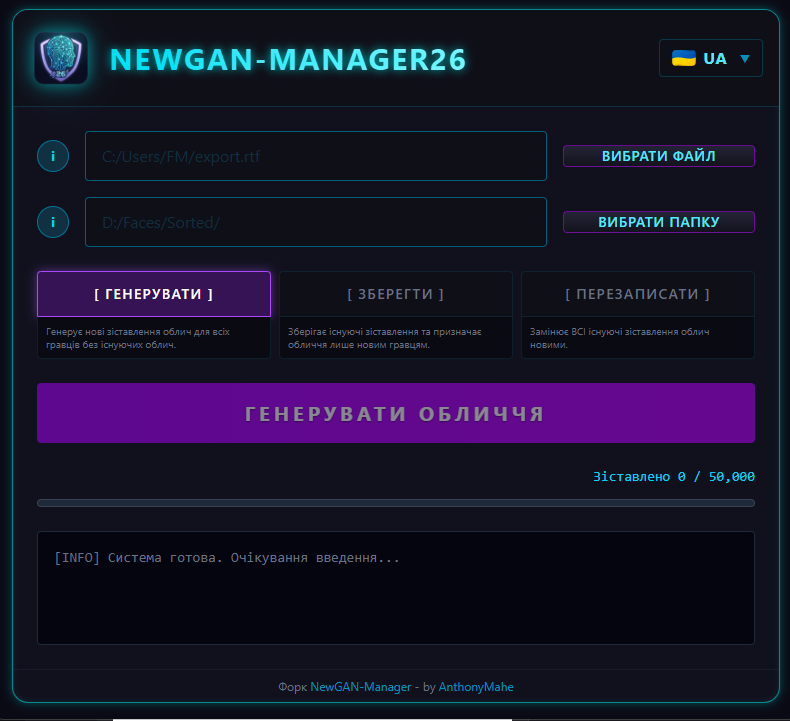

<p align="center">
  
</p>

<h1 align="center">NewGAN Manager 26</h1>

<h4 align="center">📖 Читати вашою мовою</h4>

<p align="center">
  <a href="README.md"></a>&nbsp;
  <a href="README.fr.md"></a>&nbsp;
  <a href="README.es.md"></a>&nbsp;
  <a href="README.de.md"></a>&nbsp;
  <a href="README.it.md"></a>&nbsp;
  <a href="README.pt.md"></a>&nbsp;
  <a href="README.ua.md"></a>&nbsp;
  <a href="README.kr.md"></a>&nbsp;
  <a href="README.cn.md"></a>
</p>

---


**Сучасний генератор облич для ньюгенів Football Manager 26.**

Це повний перепис оригінального [NewGAN-Manager](https://github.com/Maradonna90/NewGAN-Manager) від Maradonna90, перебудований з нуля з використанням **Tauri + Svelte 5** для покращеної продуктивності та сучасного інтерфейсу.

<p align="center">
  
</p>

---

## 🎮 Можливості

- **8 Мов**: Англійська, Французька, Німецька, Іспанська, Італійська, Корейська, Китайська, Українська
- **Сучасний Інтерфейс**: Темний інтерфейс з чистим дизайном
- **Легкий**: Побудований на Tauri (Rust + WebView) замість Electron
- **Розумна Валідація**: Кнопка генерації залишається неактивною, поки не буде вибрано дійсний RTF файл та папку зображень
- **3 Режими**: Генерувати (Generate), Зберегти (Preserve), Перезаписати (Overwrite)

---

## 📥 Встановлення

### Windows
1. Завантажте останній `.exe` (портативний) або інсталятор `.msi` з [Releases](https://github.com/AnthonyMahe/NewGAN-Manager-26/releases)
2. Запустіть програму
3. Перемістіть папки `views/` та `filters/` до вашої папки користувача Football Manager:
   ```
   Documents\Sports Interactive\Football Manager 2026\
   ```
4. Запустіть NewGAN Manager 26

### Linux
1. Завантажте `.AppImage` або `.deb` з [Releases](https://github.com/AnthonyMahe/NewGAN-Manager-26/releases)
2. Для AppImage: `chmod +x *.AppImage` потім запустіть
3. Для .deb: `sudo dpkg -i *.deb`
4. Перемістіть папки `views/` та `filters/` до вашої папки користувача Football Manager:
   ```
   ~/.local/share/Sports Interactive/Football Manager 2026/
   ```
5. Запустіть NewGAN Manager 26

---

## 🚀 Використання

### Передумови
- Використовуйте **English (UK)** як мову FM (інші мови можуть мати інші коди країн)
- Використовуйте **стандартний скін FM** (власні скіни можуть використовувати прапори замість кодів країн)

### Кроки
1. У Football Manager перейдіть до пошуку гравців/перегляду складу
2. Виберіть усіх гравців (Ctrl+A)
3. Клацніть правою кнопкою → **Експортувати як веб-сторінку** → Зберегти як `.rtf`
4. Відкрийте NewGAN Manager 26
5. Виберіть експортований файл `.rtf`
6. Виберіть вашу папку з обличчями (організовану за папками етнічності)
7. Виберіть режим:
   - **Generate**: Призначає обличчя гравцям без існуючих облич
   - **Preserve**: Зберігає існуючі призначення, призначає тільки новим гравцям
   - **Overwrite**: Замінює всі існуючі призначення облич
8. Натисніть **GENERATE FACES**

---

## 👥 Подяки

### Оригінальний NewGAN-Manager
- **[Maradonna](https://github.com/Maradonna90)**: Творець та Головний Розробник
- **Samaroy**: Координація, Генерація зображень
- **[HRiddick](https://sortitoutsi.net/user/profile/137954)**: Очищення зображень
- **[Krysler76](https://community.sigames.com/profile/157461-krysler76/)**: Хакінг переглядів FM
- **Ayal, Zealand, ZeBurgs**: Генерація зображень

### NewGAN Manager 26
- **[AnthonyMahe](https://github.com/AnthonyMahe)**: Перепис з використанням Tauri + Svelte 5

---

## 📄 Ліцензія

Rozpovsюджується за ліцензією GNU General Public License v3.0. Дивіться `LICENSE` для отримання додаткової інформації.

---

## 🐛 Вирішення проблем

Якщо ви зіткнулися з проблемами, будь ласка, [відкрийте issue](https://github.com/AnthonyMahe/NewGAN-Manager-26/issues) з:
- Вашою операційною системою
- Кроками для відтворення
- Будь-якими повідомленнями про помилки або скріншотами
